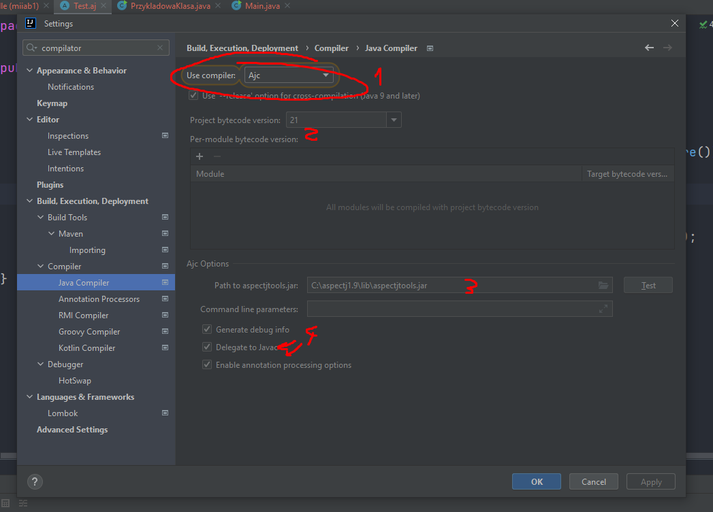
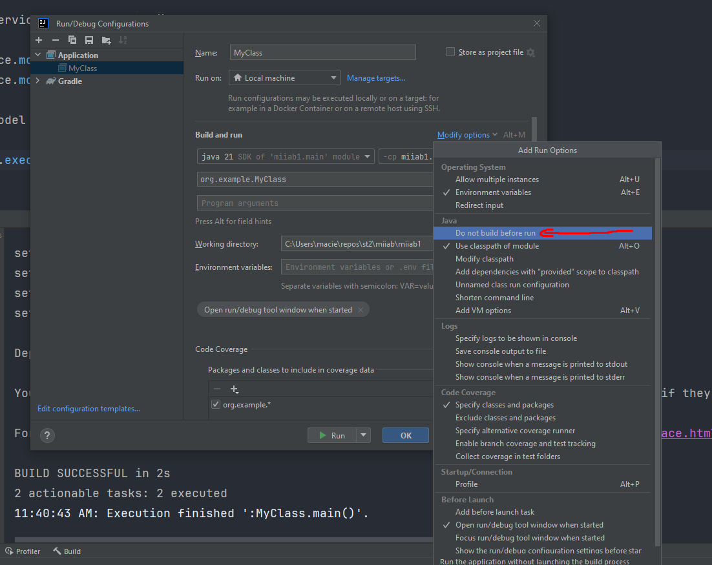
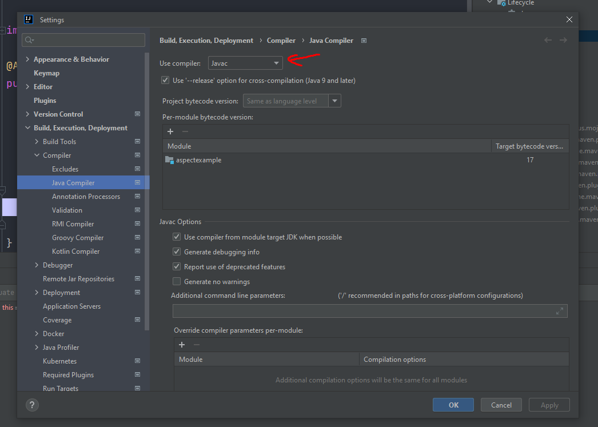

# Instrukcja instalacji AspectJ
## Wymagania
* Intellij 2023.3.4 ultimate
* plugin AspectJ i restart IDE
## Instalacja Toolsów
* https://github.com/eclipse-aspectj/aspectj/releases - Pobranie instalatora narzedzi aspectjtools, trzeba go zainstalowac i dodać zainstalowwane komponenty do zmiennych środowiskowych
## Gradle w projekcie
* dodanie id "io.freefair.aspectj" version "5.1.1" do plugins w gradle.build **NALEŻY WYBRAĆ AKTUALNĄ WERSJĘ I PODAC JA** (Link: https://plugins.gradle.org/plugin/io.freefair.aspectj)
* dodanie sekcji do gradle.build
```groovy
configurations {
    aspectj
}
```

* dodanie zależności
```groovy
    implementation 'org.aspectj:aspectjrt:1.9.21.1'
    implementation 'org.aspectj:aspectjweaver:1.9.21.1'
```

Finalny gradle.build
```groovy
plugins {
    id 'java'
    id "io.freefair.aspectj" version "8.6"
}

configurations {
    aspectj
}

group = 'org.example'
version = '1.0-SNAPSHOT'

repositories {
    mavenCentral()
}

dependencies {
    testImplementation platform('org.junit:junit-bom:5.9.1')
    testImplementation 'org.junit.jupiter:junit-jupiter'

    implementation 'org.aspectj:aspectjrt:1.9.21.1'

    implementation 'org.aspectj:aspectjweaver:1.9.21.1'

}

test {
    useJUnitPlatform()
}
```

## konfiguracja środowiska

1. zmiana z Javac na AJC (wczesniej dodane do Path i Classpath)
2. ustalenie levelu jezyka ( u mnie 21 )
3. wskazanie toolsów instalowanych z linka z github
4. zaznaczenie procesowania adnotacji i delegacji do javac (opcjonalne)

## W przypadku projektu MAVEN
Może się okazać, że potrzebne jest zaznaczenie tej opcji


## Zmiana by odpalac projekt u prowadzącego
Zmiana z Ajc na Javac



## Przydatne linki
* https://stackoverflow.com/questions/66440606/how-to-make-an-aspectj-aspect-work-in-a-gradle-project
* https://plugins.gradle.org/plugin/io.freefair.aspectj